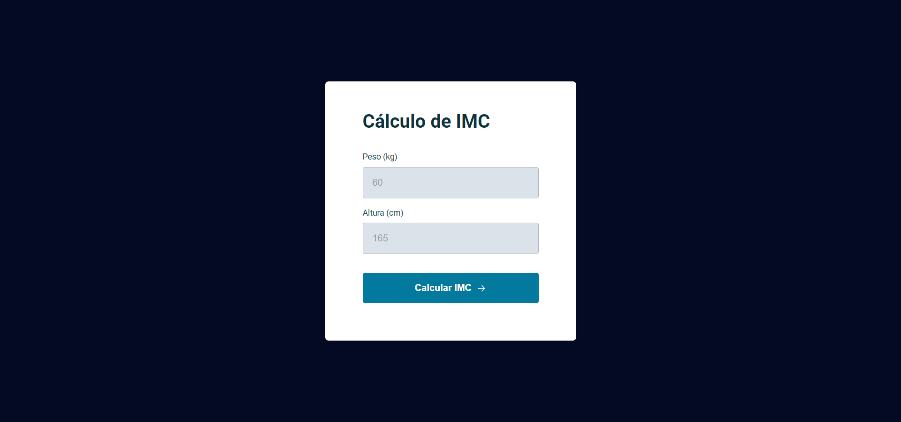

# Projeto - Calculadora de IMC

### Acesse o projeto: [Aqui](https://jonasncsantos.github.io/Projeto-Calculadora-de-IMC/)
## Sobre
Projeto desenvolvido durante aula para aplicação dos conhecimentos ensinados no curso Explorer da [Rocketseat](https://www.rocketseat.com.br/") no Stage 05.

## Aprendizados
- Manipulação da DOM
- Eventos
  - Click
  - Teclado
- Função
- Modulos
- Objetos